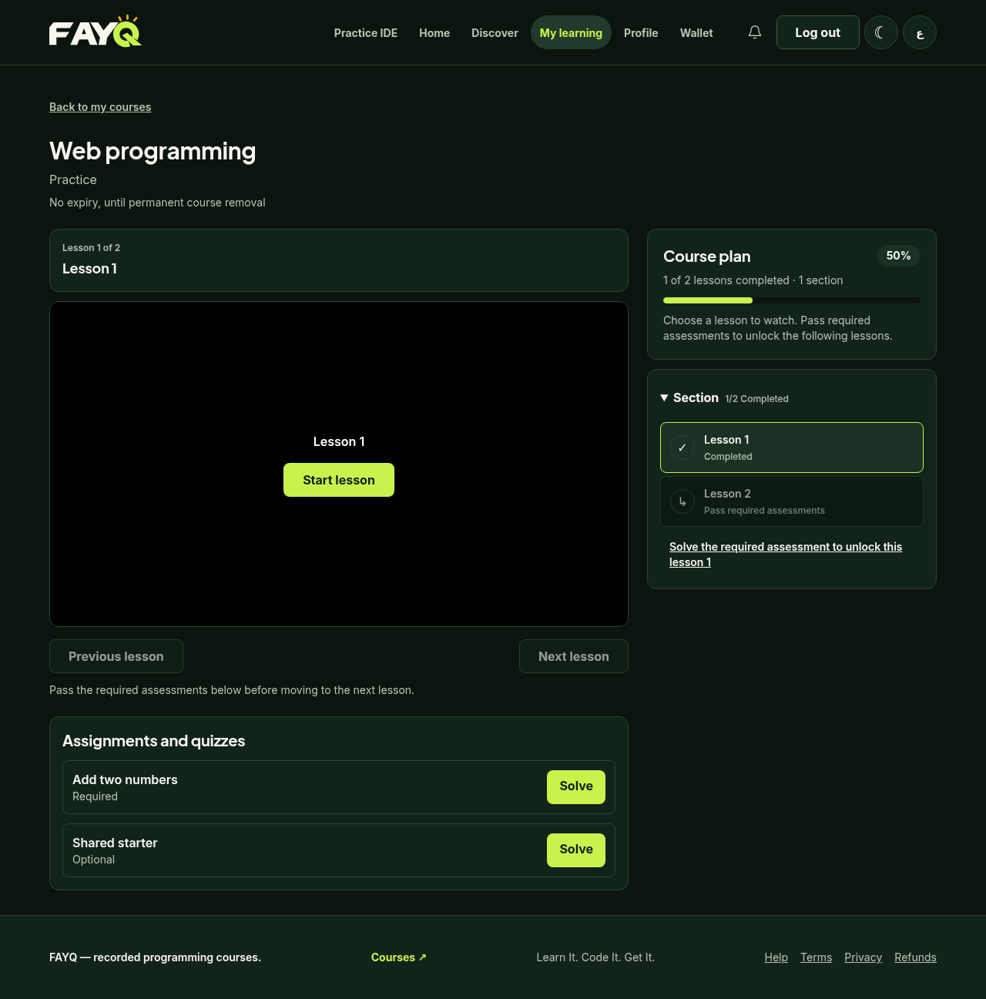
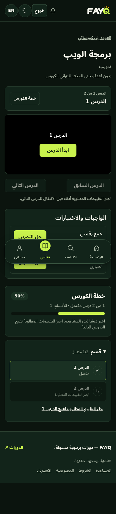
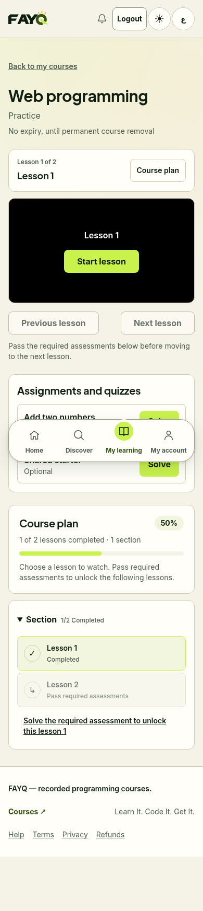

# Course curriculum and viewing UX

2026-10-04, Africa/Cairo. Owner-assigned frontend implementation and same-agent verification. Baseline `a957c91` had a clean working tree. The owner clarified that “plan” means curriculum and learning progress and explicitly requested compliance with `reports-and-markdown-files`. This work is implemented locally and available for owner review; it is not milestone acceptance or production/capacity qualification. New changes remain uncommitted.

## Delivered behavior

- Subscribed students see the existing curriculum and saved completion percentage on the course offer page. Selecting a playable lesson opens its learning context. Public/unsubscribed visitors keep the offer/purchase flow without protected lesson details.
- The learning page presents the selected lesson title and position, a start/resume action directly inside the video placeholder, and previous/next controls. Selecting an available curriculum lesson requests its playback session. Required/optional assessment policy is unchanged; locked lessons remain disabled with required-assessment links.
- A shared course plan shows total/completed lessons, section counts, completion percentage and per-section completion. Sections expand/collapse; lesson titles wrap instead of truncating. Completed, resumable, unavailable and assessment-locked states remain distinct.
- Desktop curriculum stays beside the player and scrolls independently. The mobile curriculum jump scrolls/focuses the plan without replacing the hash route. The default lesson prefers unfinished resumable content, then the first unfinished playable lesson. Explicit lesson links are checked against the authorized outline. User/course-keyed remounting clears the previous learning context when navigation changes it.
- Fullscreen now has an always-available text/icon button and video double-click support. Standard/WebKit APIs target the entire frame. Browser refusal/unavailability opens an expanded viewport mode; Escape exits, document scrolling restores, keyboard focus remains inside the expanded player and returns to its trigger. The watermark stays inside the same frame.

## Rule traceability and boundaries

| Source | Preserved requirement |
| --- | --- |
| `AGENTS.md`, `rules.md`, D01/D12 | One Express application; frontend changes only; external DRM consumed through its API. No nested DRM source edit or persistence access. |
| D09 / identity contract | Existing cookie/session authentication and Origin/CSRF protections. No new browser credential storage. |
| D11 | Curriculum uses the existing protected outline endpoint; subscription is required for lesson details. No public syllabus policy is invented. |
| Current M8/M9 contracts | Finite/indefinite entitlement, publication/deletion protection and required assessment locks stay server-enforced. No purchase, quota, grading or retention change. |
| `design.md` | FAYQ semantic tokens; Arabic/English, RTL/LTR, responsive layout and keyboard controls. The earlier Stitch output is not an implementation source. |
| Owner cleanup rule | Isolated synthetic Docker fixtures; mount/project guards; cleanup after success/failure; preserved preview, external dependency and retained volumes. |

No schema, migration, server configuration, financial policy, legal draft, role, grading isolation or external API change. Grading sockets remain confined to the existing trusted controller.

## Changed files

- `client/src/features/learning/components/CoursePlan.tsx`: shared protected curriculum/progress presentation and learning labels.
- `client/src/features/learning/components/Learning.tsx`: expandable sections and readable lesson state rows.
- `client/src/features/learning/pages/CourseLearningPage.tsx`: viewing workflow, plan sidebar, start/resume and lesson navigation.
- `client/src/features/catalog/pages/OfferPage.tsx`: subscribed curriculum and selected-lesson links; clears stale course/error data on route reload.
- `client/src/routes.ts`, `client/src/App.tsx`: learning query parsing and user/course context binding.
- `client/src/features/learning/player/fullscreen.ts`, `Player.tsx`, `client/src/styles.css`: fullscreen/expanded-view behavior and responsive plan styling.
- `docker/ide/course-flow.mjs`, `ui-review.mjs`, `compose.ui.yml`: bounded browser proof, optional isolated frontend image and existing guarded cleanup integration.
- Documentation index, `design.md`, this report and three sanitized synthetic screenshots.

## Docker verification actually run

| Check | Result |
| --- | --- |
| Frontend test-image typecheck | PASS |
| Frontend existing unit suite | 88 PASS, plus 2 DASH compatibility checks; run before the final keyboard/jump adjustments |
| Final production frontend build/typecheck | PASS; existing large-chunk advisory remains |
| Initial isolated browser proof | 37 PASS |
| Final isolated browser proof | 40 PASS; real synthetic identity, entitlement, progression and progress APIs; no uncaught browser errors |
| Retained localhost preview public browser proof | 8 PASS: readiness, mobile shell, authentication placement, routing protection, support settings and no browser exceptions |
| Isolated cleanup | `containers=0 networks=0 volumes=0`; each run removed only the owned `fayq-m9-ui` resources and private fixture file |

The 40 final assertions cover anonymous/unsubscribed refusal, protected curriculum delivery, no duplicate purchase action for an owned course, section collapse, selected-lesson links, disabled previous/next controls, required-assessment shortcuts, native fullscreen entry/exit, watermark containment, browser-refusal fallback, keyboard containment, Escape/focus/scroll restoration, double-click, real progress persistence/live merge, mobile RTL/LTR and overflow, and route-preserving curriculum jumps. Screenshots were visually inspected for English desktop dark, Arabic mobile dark and English mobile light.

The browser proof explicitly mocks playback grants and missing manifests. It establishes player UI/fullscreen behavior, not new real-video, R2, license or DRM evidence. WebKit support is implemented but not verified on physical Safari/iOS hardware. Official grading and all execution isolation settings are unchanged.

Commands run from the repository root:

```text
docker build -f client/Dockerfile --target test -t fayq-course-ux-test:20261004 .
docker run --rm --network none --label fayq.owner=course-ux-20261004 fayq-course-ux-test:20261004 npm run typecheck
docker run --rm --network none --label fayq.owner=course-ux-20261004 fayq-course-ux-test:20261004 npm test
docker build -f client/Dockerfile --target runtime -t fayq-course-ux-client:20261004 .
```

For the isolated browser proof, PowerShell set `$env:COURSE_UI_CLIENT_IMAGE='fayq-course-ux-client:20261004'` before `node docker/ide/ui-review.mjs --flow-only --course-only`. The wrapper verifies mounts/project ownership and always removes its own disposable resources. The optional inspection CLI was explicitly skipped; direct Puppeteer browser/API assertions were run.

Docker was initially stopped and started from its installed Desktop executable. Its pipe required escalation for commands. One retained-preview browser probe failed because its container had `--network none` and could not reach localhost; rerunning the trusted read-only browser with normal network access passed 8/8. This was a verification setup failure, not a passing media test.

## Local preview preservation and rollback

`node docker/ide/preview.mjs check` passed the configured retained-volume, service, image and runtime mount guards. The existing platform PostgreSQL, Redis and server containers were restarted unchanged. Only the frontend and Nginx edge containers were recreated. The original frontend image is retained as `fayq-platform-client:before-course-ux-20261004`; the tested frontend is selected by the existing `fayq-platform-client:0.9.0-m9` local tag. The existing DRM PostgreSQL/Valkey/API/worker containers were restarted unchanged with their original mounts; no migration, source edit, media operation, credential output or new data fixture was applied to the retained preview.

Local preview: `http://localhost:8080`. Existing accounts are reused. No owner rows or retained volumes were deleted or rewritten by the frontend update. Disposable test images and sanitized evidence remain available for review; no global prune.

Rollback: tag `fayq-platform-client:before-course-ux-20261004` back to `fayq-platform-client:0.9.0-m9`, then recreate only `client nginx` with the existing `.env`, `docker/local-settings.env.local`, project `fayq-local-preview`, `docker/compose.dev.yml` and `docker/compose.local.yml`, using `up -d --wait --no-deps --force-recreate client nginx`. No database rollback or volume deletion is needed.

## Proposals for a later assignment

1. Search within the protected curriculum when courses have many lessons; preserve section order and reveal matching lessons without changing access rules.
2. Show accurate lesson/course video duration if available through supported external metadata. Do not invent durations or access DRM persistence.
3. Provide Arabic/English captions and clearly labelled protected lesson resources after agreeing authoring, storage and access contracts.
4. Consider student bookmarks/notes only after confirming privacy, persistence and retention requirements. No such policy is inferred here.






