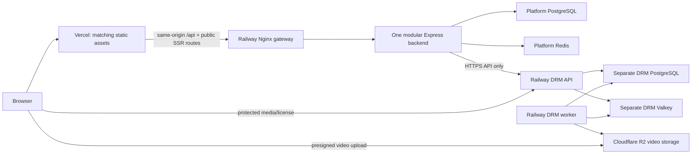

# Railway backend/DRM and Vercel frontend preparation

Owner decisions, 2026-10-07: one Railway project, separate containers/services;
prepare on `dev`, qualify on `testing`, release from `deployment`; domains configurable.
This delivery prepares artifacts and instructions. It does not deploy, provision
accounts, purchase resources, approve new hosting policies, or certify 10,000 users.

## Architecture

No combined platform/DRM container, merged schema, platform-to-DRM database access,
or platform technology replacement. The platform's internal jobs stay internal
to that application; grading execution has its own qualification gate below.

## Deliverables

| Artifact | Purpose |
| --- | --- |
| `.railway/railway.ts` | Current Railway IaC: whole-project graph with separate persistence, immutable image references and preserved private variables |
| `.railway/package*.json`, `tsconfig.json`, `railway.test.mjs` | Pinned SDK 3.13.0, Docker type-check and offline graph tests |
| `docker/railway/deployment-images.json`, `build-images.mjs` | Explicit local build targets; never pushes images or reads owner env |
| `docker/railway/gateway.Dockerfile` | Dedicated Nginx API/SSR gateway, independent of frontend serving container |
| `docker/railway/platform.env.example`, `drm.env.example` | Separate provider configuration checklists; no real values |
| `client/vercel.json`, `.env.vercel.example`, `scripts/vercel-output.mjs` | Vercel Build Output API v3 with configurable HTTPS gateway |
| `client/Dockerfile` target `vercel` | Docker-buildable inspection artifact for the frontend output |
| `docker/railway/verify-local.mjs`, `verify.compose.yml`, `verify-probe.mjs` | Synthetic production-mode rehearsal and guarded disposal |

Both server and DRM API Dockerfiles now end in `FROM runtime AS deploy`.
Automatic builds without an explicit target therefore select serving code rather
than their previous final test stages. Explicit test/migration targets still exist.
The only nested DRM change is this deployment stage alias; no source logic changed.

## Vercel setup when publishing is authorized

1. Create/link the owner-selected frontend project. Root directory: `client`.
   Framework: Other; install `npm ci`; build `npm run build:vercel`.
   Leave output-directory override unset: the build emits `.vercel/output` using
   the Build Output API. Use the committed `client/vercel.json`.
2. Set `RAILWAY_GATEWAY_ORIGIN` to that environment's HTTPS Railway gateway origin,
   without a path, query, credentials or custom port. It is a public routing value.
   Keep `VITE_API_BASE=/api` and `VITE_DEFAULT_LANG=ar`.
3. Set the production branch to `deployment`; use `testing` for the qualified
   preview environment. A `dev` preview is not release evidence. Arbitrary preview
   domains are not automatically authorized for login, DRM, R2 or production data.
4. Build backend SSR and Vercel static assets from the SAME platform revision and
   frontend build settings. Verify that SSR references resolve to the exact Vercel
   asset hashes before promotion. Do not promote only one side of a changed bundle.
5. `/api/*` rewrites keep cookie/CSRF traffic on the student's frontend origin.
   Do not replace this with direct cross-site `VITE_API_BASE`: current host-only
   cookies and readable same-origin CSRF depend on the proxy.
   API routes are no-store, hashed assets cacheable, public pages/robots/sitemap
   retain Express rendering and status. Static root index is intentionally removed
   so the filesystem handler cannot bypass `/` SSR.
6. Real cloud qualification must prove login/refresh/logout, exact Origin checks,
   protected API paths, cookies, WebSocket upgrade/reconnect and fallback, maximum
   supported resource/QR upload sizes, SSR 404/canonical/robots/sitemap and HTTPS
   media in actual browsers. The local rehearsal is not a Vercel edge test.

## Railway setup and migrations

Use separate `testing` and `production` environments, with independent databases,
keys, receiving accounts, storage scopes and tenants. Platform backend, workers,
databases and migration jobs have no public domain. Gateway and DRM API get the
approved HTTPS public domains. Same-project network membership grants no database
ownership across the platform/DRM boundary.

The IaC is steady-state desired configuration, NOT an ordered release controller.
Do not apply the whole graph to a fresh environment with automatic serving startup.
Initial release is staged manually in Railway: create persistence, configure private
variables, launch only one-shot migration jobs, require both exit zero, then create
or start serving services. Import/compare that state before the first IaC apply.
For subsequent releases run migrations with the candidate images before updating
serving-image references. A failed migration blocks release; never roll back by
dropping migration rows/tables. Verify backup/restore before changing persisted data.

| Service | Artifact / command | Release check |
| --- | --- | --- |
| platform-migrate | server `migrate`: `npx prisma migrate deploy` | exit 0 against PLATFORM database |
| platform-backend | server `deploy`: `node dist/index.js` | `/health/ready` |
| platform-gateway | gateway image | `/api/health/ready`; backend host uses private DNS |
| drm-migrate | DRM API `deploy`: `node packages/database/dist/generate.js` | exit 0 against DRM database |
| drm-api | DRM API `deploy`: `node apps/api/dist/index.js` | `/health`, including storage |
| drm-worker | DRM worker `runtime`: `node apps/worker/dist/index.js` | processing/deletion/reconciliation and shutdown evidence |
| drm-valkey | approved Valkey image pinned by digest | private, password protected, AOF, own `/data` volume |

The DRM runner is `generate.js`, NOT the export-only `migrate.js`. The historical
DRM production Compose still names that old runner; do not use it as this Railway
release recipe. The prepared verification uses the actual runner successfully.
Serving platform images deliberately exclude Prisma CLI; don't put its command
in a backend-image pre-deploy hook that cannot execute it.

Publish images only after release authorization. Capture registry digests and set
`PLATFORM_RUNTIME_IMAGE`, `PLATFORM_MIGRATE_IMAGE`, `PLATFORM_GATEWAY_IMAGE`,
`DRM_API_IMAGE`, `DRM_WORKER_IMAGE`, `DRM_VALKEY_IMAGE` for the IaC evaluation.
Select compatible Railway-managed `PLATFORM_POSTGRES_IMAGE`, `DRM_POSTGRES_IMAGE`
and `PLATFORM_REDIS_IMAGE` by digest too: maintain the qualified PG16/Redis7 majors
unless a separate upgrade is approved. Verify provider templates generate the right
credentials and use the declared `/var/lib/postgresql/data` and `/bitnami` mounts.
Do not substitute generic Redis with ignored managed password variables. The SDK's
convenience helpers currently select PG18/Redis8.2; this graph avoids that implicit upgrade.
The SDK rejects mutable tags. Local Docker image IDs in the report are NOT published
registry digests. CLI minimum for the pinned SDK: 5.42.1.

Set private variables directly in provider settings. `preserve()` means retain
existing values, not create missing secrets. Set shared `DRM_REDIS_URL` to the
authenticated private Valkey URL; it is used only by DRM API/worker. Set Valkey's
`VALKEY_PASSWORD` to the matching secret. Back up its persistent volume separately.
Do not print config renders, tokens, env files, signed URLs or national IDs.

Current official Railway docs supersede old Config-as-Code files for new services.
The old `docker/railway/*.railway.json` files are historical and not attached to
this graph. Before ANY IaC apply, review `plan` for unexpected resource/variable/
volume deletion, startup, source changes and overlapping legacy configuration.
This whole-project graph must include all resources intended to survive; omission
can delete resources. Do not apply it to unrelated/existing projects unchanged.

## Domain and security wiring

| Setting | Value to select at release |
| --- | --- |
| Vercel `RAILWAY_GATEWAY_ORIGIN` | public HTTPS Railway gateway origin |
| platform `ALLOWED_ORIGINS` | exact approved frontend origin(s); no wildcard previews |
| platform `SEO_PUBLIC_ORIGIN` | approved canonical frontend HTTPS origin |
| platform `DRM_BASE_URL` / `DRM_PUBLIC_BASE_URL` | DRM HTTPS public API/media origin (current production validation requires HTTPS) |
| platform `DRM_ASSERTION_ISSUER` | matches DRM `JWT_ISSUER` exactly |
| assertion audience | matches DRM `JWT_AUDIENCE` exactly |
| DRM `JWT_JWKS_URL` | frontend `/.well-known/jwks.json` or `/api/.well-known/jwks.json`; verify JSON, not SPA HTML |
| DRM `CORS_ORIGIN` | exact approved frontend origin(s) |
| R2 video bucket CORS | exact approved browser-upload origins and required PUT headers; behavioral browser proof |

Keep `COOKIE_SECURE=true`, production Argon2 costs, RS256, HTTPS and assertion
verification. National-ID encryption/index keys are independent and must follow
the restored database; do not rotate them casually. Preserve DRM master keys with
media/persistence backups. Do not import owner preview users/videos without an
explicit migration decision. Production has no fixture assertions, development
ClearKey, test admin defaults or generic local payment instructions.

The gateway currently trusts Railway-injected client IP headers. With Vercel now
in front, qualification MUST prove an unspoofable original-IP contract and working
per-student/IP rate limits through both proxies. No claim is made that Vercel
automatically preserves the current rate-limit identity. Do not start trusting
arbitrary incoming forwarded headers to resolve it.

## Branch and repository release sequence

Preparation was reviewed locally on `dev` in both repositories. The owner authorized
commit/push on 2026-10-07: DRM `71c49dd` is delivered and the platform pins it.
Local tests verify the candidate, not a `testing` branch release. Release sequence:

1. Commit the bounded DRM Dockerfile change on DRM `dev`.
2. Record that exact DRM commit in the platform gitlink and commit platform `dev`.
3. Merge/promote the same candidates to `testing` in BOTH repositories; build and
   qualify those exact revisions. Record artifacts, config and evidence.
4. Only after release approval promote to `deployment` in both repos. Build/publish
   immutable candidate images and matching Vercel output, gate migrations and
   public-domain/browser checks, then promote traffic. Never silently deploy `dev`.
5. Roll back paired frontend/backend image revisions if compatible with current
   schema; retain DB/media/keys, never reset them to roll back serving code.

Pre-existing condition at preparation: the platform gitlink pointed at `52853b3`,
while the clean nested checkout was already `d1bfd69`. Approved delivery now pins
`71c49dd`, containing the previously published baseline and the bounded serving
stage alias. This is explicit dependency delivery, not nested source rewriting.

## Remaining release gates

- **IDE grading host:** existing production controller requires gVisor `runsc` and
  a trusted Docker daemon. Only the controller may access its socket; web replicas
  and untrusted jobs never may. Railway placement is not qualified. An owner question
  for a separate Docker execution host is pending; no new hosting architecture was
  adopted. Required assessments cannot be released as working without a grader.
- **Commercial DRM:** configure/qualify the supported provider. This graph keeps
  `CLEAR_KEY_ENABLED=false` and `PREMIUM_DRM_REQUIRED=true`; missing credentials
  block production. This is also an implementation gate, not just credentials:
  current `apps/api/src/services/license.service.ts` explicitly refuses non-ClearKey
  issuance with `DRM_PROVIDER_NOT_CONFIGURED`, and the Widevine provider's response
  method is an unimplemented stub. Adding environment values alone cannot enable
  commercial playback. A separate owner-assigned DRM integration is needed.
  Local ClearKey success is not commercial DRM evidence.
- **Domains/provider wiring:** owner has not selected them; cloud project IDs,
  routing/cookies/CORS/IP/WebSocket/upload-size behavior remain unverified.
- **Persistence/recovery/alerts:** select region/budgets/resource sizes, database
  major version, backups and retention; prove restore of both databases, keys,
  Valkey and R2 lifecycle, worker recovery and alert delivery before release.
- **Dependencies/capacity:** client install reports 8 advisories (2 moderate, 6 high).
  Existing local build-tool mitigations are present but this task is not a fresh
  independent advisory disposition. Review current runtime/build exposure before
  publishing. Existing large IDE/player bundle warnings remain. No 10k load test,
  sizing or certification occurred; replica/resource choices need measured staging
  qualification and owner spending approval.

## Sources checked 2026-10-07

This recipe follows [Railway IaC](https://docs.railway.com/infrastructure-as-code)
and its [TypeScript reference](https://docs.railway.com/infrastructure-as-code/reference),
and [Vercel Build Output API](https://vercel.com/docs/build-output-api) with its
[routing configuration](https://vercel.com/docs/build-output-api/configuration).
The pinned SDK was actually installed and type-checked in Docker; no provider
account was connected or infrastructure plan/apply/deployment executed.
