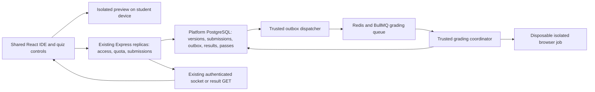

# M9 — proposed architecture, capacity and gap review

**Supersession:** complete implementation is now owner-authorized under [the contract](m9-implementation-contract.md); the delivered local isolation/topology and evidence are in [the report](m9-implementation-report.md) and [runbook](m9-docker-runbook.md). Proposal/pending wording below is historical. Numeric grading SLA, production hosting and 10,000-user qualification remain unapproved/unproven.

2026-10-01. **Planning only.** Companion to the [manager plan](m9-ide-assessments-manager-plan.md). This is a reviewed proposal for discussion, not an implementation assignment, amended original system design, benchmark, deployment or capacity certificate. No runtime or database change is made. The owner requires 10,000 simultaneous IDE users and accepted fair queued checking while editing remains usable. Numeric waiting-time guarantees and paid capacity remain undecided.

## Confirmed behavior

- One reusable HTML/CSS/browser-JavaScript/DOM IDE serves practice and coding assignments/quizzes. Multiple-choice is also required and uses ordinary answer controls.
- Practice requires at least one active course subscription. Default 50 intentional Run clicks per Cairo calendar day. ADMIN overrides persist until changed/restored.
- ADMIN Reset immediately replenishes the effective allowance and changes that student to recurring 24-hour windows anchored to the reset time. It does not revert to midnight. Other students retain Cairo-calendar windows.
- Exercises are exempt from the practice allowance; retries until correct are unlimited. ADMIN defines expected outputs and DOM checks; no source-text/pattern matching.
- Checking must be trustworthy. Client success flags cannot establish a grade. ADMIN marks assessments required or optional; only required assessments block next-lesson progression. Preserve existing students' already reached lessons at rollout. Existing subscription/publication rules still apply.

## Recommended structure

Keep one horizontally replicable Express business backend with internal assessment/practice modules, the existing React app, Nginx, platform PostgreSQL/Prisma and Redis. DRM remains independent and API-only. Grading is a separate execution boundary and scaling pool, not another identity/catalog/wallet backend. Its concrete isolation and deployment arrangements need owner review before implementation.

The original [architecture](architecture.md) already names Redis/BullMQ. Source inspection shows BullMQ is not yet a dependency of `server/package.json`; this plan does not treat it as installed. Dependency adoption, queue configuration and scheduling must be a bounded future package. Do not silently substitute a new database, paid queue product or deployment provider.

### Interactive preview on the student's device

Lazy-load self-hosted editor assets only on IDE routes. Editing, preview rendering and DOM interaction consume the student's device resources. No server browser, container or socket is created for each open editor. Source is sent for trusted execution on Submit, not every keystroke or preview interaction. Official standalone Runs additionally use the approved quota reservation contract.

Prefer a dedicated, cookieless sandbox origin/site with restrictive sandbox flags and its own CSP, no authenticated application context and narrowly validated messages. The specific origin/hosting arrangement is proposed, not approved. Restrict network, navigation, popups, storage, resource loading and console/message output; HTML/CSS can initiate requests too. Use fresh execution state, run IDs and bounded plain-text console rendering. Submission code and HTML must also render inertly on ADMIN review pages.

**Responsiveness is a feasibility blocker:** Workers cannot directly manipulate the DOM. A frame can run DOM code, but a frame alone does not guarantee an interruptible infinite loop or a hard memory limit. Distinct-site process isolation depends on browser/platform behavior; it is not a universal portable guarantee. Prove recovery/Stop and editor responsiveness on supported desktop and mobile browsers before fixing the preview architecture. Do not silently replace real DOM with a mock or assume a timer in the blocked page can interrupt it. [MDN Workers](https://developer.mozilla.org/en-US/docs/Web/API/Web_Workers_API/Using_web_workers), [Chromium site isolation](https://www.chromium.org/Home/chromium-security/site-isolation/), [MDN iframe sandbox](https://developer.mozilla.org/en-US/docs/Web/HTML/Reference/Elements/iframe).

Browser isolation/CSP and application-cookie rules need hostile-code checks, not merely an example that renders successfully. If the prototype cannot satisfy the supported-browser contract, return with alternatives and their costs; remote execution for every Run would materially change this capacity model. A browser-only official Run counter cannot prevent a student from executing copied code in their own browser or elsewhere. Clarify whether limiting platform controls is sufficient; strict service-mediated execution is a different requirement.

### Durable submission and trusted checking

Proposed path, requiring reviewed contracts:

1. Express verifies session/CSRF, student ownership, current course access, assessment availability/prerequisites and immutable assessment version. It validates bounded source/answer sizes. Capture backend time rather than client claims.
2. Commit immutable submission input, a scoped idempotency record and a durable outbox item in one PostgreSQL transaction. Return a receipt and Checking/queued status promptly, without holding an HTTP request until code completes. Admission limits must be checked before accepting work.
3. Dispatch a deterministic job reference to BullMQ. Persisted input/tests stay authoritative outside Redis; queued payloads should not duplicate every source document or contain signing secrets. Recover committed work after enqueue failure or queue loss. Queue deduplication is not an exactly-once database guarantee.
4. A trusted coordinator obtains narrowly scoped inputs, leases the job and starts a disposable isolated browser runtime. The executed student code has no database/Redis/DRM credentials, platform cookies, host mounts, Docker socket or external network access. No student execution inside Express, the coordinator's Node process or an authenticated ADMIN page.
5. Check real browser behavior. Hold correctness authority outside the student-controlled page; do not accept its `passed` message. Treat overridden globals, DOM/console APIs, prototypes, getters, result serialization and test-channel spoofing as adversarial cases. Keep private test definitions/answer keys out of student APIs/bundles. Do not promise that test inputs exercised in the student's code are themselves unobservable.
6. Commit the bound result using lease/fencing and uniqueness rules, rejecting stale or duplicate worker completion. A trusted pass may update prerequisite facts atomically. Infrastructure failure differs from Incorrect. Clean all job resources on success, crash, timeout or cancellation.
7. The student reads the durable result through the existing authenticated backend. Propose multiplexing completion notices over the existing recipient-scoped Socket.IO connection; reconnect/result GET remains authoritative. This does not automatically add grading events to M6's notification retention policy. Use bounded, jittered polling if needed rather than one-second polling from every editor.

Design for retryable delivery and idempotent processing, including a crash after result commit. BullMQ's own guidance requires idempotent jobs when retries occur; a queue record alone cannot close the persistence/crash gaps. [BullMQ idempotent jobs](https://docs.bullmq.io/patterns/idempotent-jobs).

### Isolation and resource separation

Use an execution host pool isolated from login, wallet, database and DRM resources. Each untrusted grading job gets disposable execution state and bounded CPU, memory, processes, wall time, source/test sizes and output. Fresh browser contexts inside one shared browser process are not the complete boundary for mutually untrusted students. Do not reuse a dirty sandbox across submissions. Warm clean capacity can reduce startup latency after isolation is proven.

Investigate an OCI sandbox runtime such as gVisor first, with a microVM boundary as an alternative if the threat/compatibility review requires it. No final runtime is selected: benchmark browser compatibility, syscall overhead, startup, cleanup and host support. gVisor integrates with Docker but has compatibility/performance tradeoffs; ordinary Docker development success does not establish the production isolation guarantee. Do not disable Chromium's sandbox merely to make the image start. [gVisor runtime and tradeoffs](https://gvisor.dev/docs/), [Firecracker architecture](https://firecracker-microvm.github.io/).

The trusted orchestrator must not expose host orchestration credentials to a job. Its launcher permissions and management network require a concrete least-privilege contract. Separate coordinator control/results from the untrusted page/network. The execution host itself must not sit on a network with unrestricted access to platform data services or cloud metadata. A Node `vm` is not a hostile-code security boundary. [Node VM documentation](https://nodejs.org/api/vm.html).

Redis key prefixes separate names, not CPU/memory capacity. Propose a grading-specific Redis instance if measured contention could affect auth, quotas or notification delivery; this uses existing technology but is an additional topology decision requiring approval. Never use DRM Valkey or persistence for platform jobs. Budget PostgreSQL pools across API replicas and trusted persistence workers; 10,000 online students do not require 10,000 database connections.

## Queue fairness and overload

The owner accepted a fair bounded queue and Checking UX; unlimited educational retries remain intact. Recommend a bounded number of outstanding submissions per student and fair admission/scheduling across students. Temporary pacing is not a lifetime attempt cap. A retry with the same idempotency key is the same logical work; an intentional new answer is a new attempt.

Separate ordinary multiple-choice evaluation from expensive browser jobs. A mixed quiz needs an approved aggregation rule before a whole-quiz pass is recorded. Limits should account for test count/complexity, not let one assessment monopolize capacity. Do not assume paid BullMQ Pro grouping is available; specify and test fairness with approved capabilities.

Accepted work must not be silently dropped. If durable acceptance succeeds but queue delivery fails, keep the receipt pending and recover delivery. If admission capacity is exhausted before acceptance, return a temporary service state with retry guidance, preserve the answer and record no false grade. Busy, Checking, Incorrect and infrastructure-error states must be distinct. Set admitted backlog, age limits and resource budgets to measured capacity; no finite queue can absorb unlimited sustained overload.

## What 10,000 concurrent students means

| Scenario | Dominant work | Required planned evidence |
| --- | --- | --- |
| 10,000 editor pages open | Static asset delivery, authentication, browser memory | Startup burst, asset budget, supported-device responsiveness |
| 10,000 simultaneous local Runs | Browser CPU/DOM plus quota admission requests | Preview responsiveness/isolation; atomic replicated quota burst |
| 10,000 submissions arrive together | Input persistence, durable admission, queue, grading | Fair burst completion, acceptable measured wait, no lost/duplicate results |
| Sustained frequent submissions from 10,000 users | Long-running arrival rate versus execution throughput | Stable backlog, bounded tail latency and unaffected core platform |
| 10,000 grading jobs execute at the same instant | Large execution-host CPU/RAM allocation | A separate expensive capacity requirement; not implied by editor concurrency or the accepted queue |

The proposed queue handles the third scenario without pretending all jobs execute simultaneously. This interpretation must remain explicit. The platform's earlier 10,000-user qualification is still open; M9 does not retroactively certify it.

Illustrative sizing, **not benchmarks, promises or chosen configuration**: with burst `B`, clean parallel execution slots `C` and job duration `S`, ideal clearance is approximately `ceil(B/C) × S`, excluding scheduling, startup, persistence and failures. For 10,000 jobs at an assumed two seconds each:

| Assumed active grading slots | Ideal burst clearance |
| --- | --- |
| 100 | 200 seconds |
| 500 | 40 seconds |
| 1,000 | 20 seconds |

Measure the real distribution of HTML/CSS/DOM tests before choosing `C`. Node async concurrency settings do not manufacture browser CPU or memory. Sustainable arrival rate must stay below measured throughput with headroom; fairness alone cannot solve capacity shortage. Required resources depend on measured per-job CPU/RAM and supervisor overhead, including peak browser memory. No concrete worker count or hosting-plan price is justified yet.

Other arithmetic illustrates why request design matters:

- 10,000 students × default 50 practice Runs is 500,000 official Runs/day, approximately 5.8/second averaged over a whole day. That average says nothing about a 10,000-request burst, custom allowances or unlimited exercise traffic.
- Saving 10,000 continuously dirty drafts every second would cause 10,000 saves/second; every 30 seconds would average about 333. These are examples, not an approved autosave interval. Propose dirty-only debouncing, jitter, bounded document sizes and revision conflict handling if server autosave is approved.
- Polling 10,000 Checking screens every second adds 10,000 reads/second. Prefer existing authenticated event delivery plus durable recovery, with bounded fallback polling.

## Quota scheduling without a midnight write storm

Propose lazy window rollover during quota reads/reservations, rather than a midnight cron updating every student. Compute Cairo calendar boundaries with the actual timezone, including daylight-saving transitions. For manually reset students, use exact 24-hour intervals from the backend reset anchor; unused past windows do not accumulate or grant multiple allowances on return.

Use one durable, atomically updated student/window counter and scoped reservation identity. A reset changes the window epoch; concurrent reset/change/Run transactions must have an explicit serial order. Redis can accelerate coordination but must not silently become an easily lost authoritative balance. No localStorage quota authority. Review SQL/Redis crash behavior before selecting implementation details.

Restoring default changes the limit to 50; it does not imply switching the clock back to Cairo midnight or erasing history. Lowering below already consumed usage, zero/maximum limits and syntax/runtime versus infrastructure-failure charging need owner contracts. Read-only editing and exercise exemption must survive exhaustion; a reset never grants course access.

Unlimited retries also mean retained submission source/history can grow beyond the practice quota. Set explicit retention and per-document size policies before forecasting database growth; do not infer indefinite source retention from unlimited educational attempts. Proposed indexed read paths are student/window usage, student/course prerequisites, submission/result identity and pending outbox/job eligibility. Concrete indexes and atomic transaction boundaries belong in the approved schema contract, not a guessed migration now.

## Prerequisite access and assessment edits

The owner requires required assessments passed before opening the next lesson and explicitly chose ADMIN-controlled required/optional status. Optional assessments do not block progression. Propose a server-side ordered prerequisite chain so a direct request to a later lesson cannot bypass an earlier lock. Define behavior for lessons with no required assessments and order across sections; do not invent a video-watch threshold. No required/optional creation default is approved yet.

Apply the approved authority to outlines, new playback grants, renewals, exercise delivery/submission and any progress-based navigation. Publication and entitlement remain mandatory even after a pass. Client progress records are not proof of passing. Multiple-choice/coding checks must produce the approved trusted pass fact; queue or infrastructure errors never unlock the next lesson.

**Confirmed rollout protection:** existing students keep lessons they have already reached; apply the new requirements to progression afterward. Define the authoritative reached-lesson evidence and a rollout cutoff/snapshot before implementation. Recommend durable per-student/lesson unlock records that bypass only the new prerequisite gate. Do not manufacture passing submissions/grades, grant every unvisited lesson automatically, or confuse this protection with a subscription extension. Expired access and unpublished/archived/deleted content remain protected by existing authority.

Version pass facts and prerequisite definitions. Newly added assessments, optional-to-required changes, corrected questions, reordered/archived/deleted lessons and already-open playback sessions still require a content-edit transition policy. Launch preservation does not settle every later edit. Do not erase passes or revoke sessions because an ADMIN edited content without the reviewed contract. Full lesson gating is new behavior, not a harmless UI-only addition. No DRM protocol/database change is needed.

## Gaps to close before implementation

| Gap | Recommendation or next decision | Why it matters |
| --- | --- | --- |
| Preview interruption and mobile support | Prove real DOM execution and responsive recovery on the supported browsers first | An infinite loop can invalidate the usable-IDE requirement |
| Concrete grading security boundary | Benchmark and threat-review the selected sandbox/browser topology | Correct results and safe hostile-code execution cannot rely on a client flag or ordinary shared container |
| Queue objective and execution budget | Define measured normal/burst wait objectives, backlog limits and sustained workload before sizing | A fair queue does not guarantee an unmeasured completion time |
| Pass rule and required/optional edits | ADMIN selection is confirmed; define quiz pass aggregation, creation default and later edits | “Correct” and next-lesson unlocking must have one meaning |
| Rollout evidence and assessment edits | Preserving reached lessons is confirmed; define the snapshot/evidence and later content-version transitions | Avoid silent loss of purchased access/progress without inventing grades |
| Official Run enforcement | Agree platform-control quota versus strict service-mediated execution | Browser-local preview changes enforcement and cost |
| Quota edge policies | Agree failure charging, allowed overrides and lowered-limit behavior | Prevent inconsistent counts and hidden extra allowance |
| Visibility, feedback and persistence | Agree hidden/visible tests, hints, draft/history retention and post-correct behavior | Privacy, storage growth and educational UX |
| Runtime capabilities | Recommend no arbitrary external network/packages initially; seek approval | Network access changes threat model and reproducibility |

## Bounded future evidence and stop conditions

First approve contracts, then run a small isolated Docker feasibility package: correct/wrong DOM solutions, forged result attempts, malicious globals, endless loops, memory/output/network abuse, and supported browser recovery. Resolve failure before developing the full feature. Measure ordinary and adversarial grading cost with limited concurrency; retain sanitized evidence and clean owned resources.

Only after that, prepare a separately authorized capacity package: progressively sized quota/submission bursts, sustained mixed traffic, fairness, queue/worker restarts, fencing/duplicate delivery and auth/wallet/learning behavior under grading pressure. Include real browser and coordinator costs; mocks cannot certify execution throughput. Paid staging/load tests remain deferred until their environment and budget are assigned.

Do not keep repeating unrelated full suites after unchanged passing evidence. Recheck affected contracts after a change or failure, and run a final bounded regression review. Preserve the port-8080 owner preview and all existing video/data; no global prune. No current benchmark, implementation, dependency installation, service start or deployment is authorized by this planning document.
